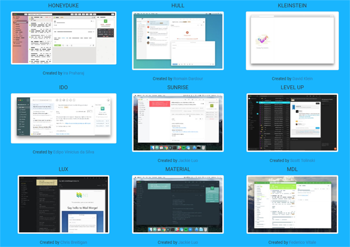

<h1>Nylas Mail Community Themes</h1>

	
A curated list of community made and non-bundled <a href="https://github.com/nylas/nylas-mail">Nylas Mail</a> N1 themes.

	

## Sections
* Preview
* [Themes](https://github.com/Sgouws/nylas-mail-community-themes#themes)
* [Compatibility](https://github.com/Sgouws/nylas-mail-community-themes#compatibility)
* [Installation](https://github.com/Sgouws/nylas-mail-community-themes#installation)
* [Create Your Own Theme](https://github.com/Sgouws/nylas-mail-community-themes#create-your-own-theme)
* [Contributions and Submissions](https://github.com/Sgouws/nylas-mail-community-themes#contributions-and-submissions)
* [Issues](https://github.com/Sgouws/nylas-mail-community-themes#issues)
* [To-Do](https://github.com/Sgouws/nylas-mail-community-themes#to-do)

## Preview (Work in progress)
I've created a page where you can see screenshots of all the available themes, as well as browse and download at your leisure. I'd recommend starting here.

This is incomplete and coming soon:
[Community Themes](https://sgouws.github.io/nylas-mail-community-themes/)

## Themes
* Agapanthus - Inspired on Inbox by Google. Based on [Taiga](https://github.com/noahbuscher/N1-Taiga) - ([source](https://github.com/taniadaniela/n1-agapanthus), [preview](https://sgouws.github.io/nylas-mail-community-themes/))
* Arc Dawn - ([source](https://github.com/varlesh/Nylas-Arc-Dark-Theme), [preview](https://sgouws.github.io/nylas-mail-community-themes/))
* Bemind - ([source](https://github.com/bemindinteractive/Bemind-N1-Theme), [preview](https://sgouws.github.io/nylas-mail-community-themes/))
* Berend - ([source](https://github.com/Frique/N1-Berend), [preview](https://sgouws.github.io/nylas-mail-community-themes/))
* BoraBora - ([source](https://github.com/arimai/N1-BoraBora), [preview](https://sgouws.github.io/nylas-mail-community-themes/))
* Coloraiz - ([source](https://github.com/webeproject/Coloraiz-Theme-N1), [preview](https://sgouws.github.io/nylas-mail-community-themes/))
* Darkish - ([source](https://github.com/dyrnade/N1-Darkish), [preview](https://sgouws.github.io/nylas-mail-community-themes/))
* Darkside Spark - ([source](https://github.com/ronilaukkarinen/ui-darkside-spark), [preview](https://sgouws.github.io/nylas-mail-community-themes/))
* DarkSoda  - ([source](https://github.com/adambullmer/N1-theme-DarkSoda), [preview](https://sgouws.github.io/nylas-mail-community-themes/))
* Dracula  - ([source](https://github.com/dracula/nylas-n1), [preview](https://sgouws.github.io/nylas-mail-community-themes/))
* Elementary Full - ([source](https://github.com/edipox/elementary-nylas), [preview](https://sgouws.github.io/nylas-mail-community-themes/))
* Elementary Soft - ([source](https://github.com/edipox/elementary-nylas), [preview](https://sgouws.github.io/nylas-mail-community-themes/))
* Express - ([source](https://github.com/oeaeee/n1-express), [preview](https://sgouws.github.io/nylas-mail-community-themes/))
* Firefox - A Firefox Inspired Theme - ([source](https://github.com/darshandsoni/n1-firefox-theme), [preview](https://sgouws.github.io/nylas-mail-community-themes/))
* Gmail - A Gmail Inspired Theme - ([source](https://github.com/dregitsky/n1-gmail-theme), [preview](https://sgouws.github.io/nylas-mail-community-themes/))
* Honeyduke - ([source](https://github.com/arimai/n1-honeyduke), [preview](https://sgouws.github.io/nylas-mail-community-themes/))
* Hull - ([source](https://github.com/unity/n1-hull), [preview](https://sgouws.github.io/nylas-mail-community-themes/))
* Kleinstein - Hides sidebar when no new messages  - ([source](https://github.com/diklein/Kleinstein), [preview](https://sgouws.github.io/nylas-mail-community-themes/))
* Ido - ([source](https://github.com/edipox/n1-ido), [preview](https://sgouws.github.io/nylas-mail-community-themes/))
* Inbox - Google Inbox Inspired Theme - ([source](https://github.com/himanshu-dixit/Inbox-Theme-For-Nylas-N1), [preview](https://sgouws.github.io/nylas-mail-community-themes/))
* Level Up - ([source](https://github.com/stolinski/level-up-nylas-n1-theme), [preview](https://sgouws.github.io/nylas-mail-community-themes/))
* Lux - ([source](https://github.com/breitigan/Lux-N1-Theme), [preview](https://sgouws.github.io/nylas-mail-community-themes/))
* Material - ([source](https://github.com/jackiehluo/n1-material), [preview](https://sgouws.github.io/nylas-mail-community-themes/))
* MDL - ([source](https://github.com/Rawnly/n1-mdl), [preview](https://sgouws.github.io/nylas-mail-community-themes/))
* Monokai - ([source](https://github.com/dcondrey/n1-monokai), [preview](https://sgouws.github.io/nylas-mail-community-themes/))
* MouseEatsCat - ([source](https://github.com/MouseEatsCat/MouseEatsCat-N1), [preview](https://sgouws.github.io/nylas-mail-community-themes/))
* Narc - ([source](https://github.com/hugolabe/N1-Narc), [preview](https://sgouws.github.io/nylas-mail-community-themes/))
* Predawn - ([source](https://github.com/adambmedia/N1-Predawn), [preview](https://sgouws.github.io/nylas-mail-community-themes/))
* Simple - ([source](https://github.com/rdunk/N1-Simple), [preview](https://sgouws.github.io/nylas-mail-community-themes/))
* Slack - ([source](https://github.com/jodyheavener/N1-Slack), [preview](https://sgouws.github.io/nylas-mail-community-themes/))
* Snow - ([source](https://github.com/Wattenberger/N1-snow-theme), [preview](https://sgouws.github.io/nylas-mail-community-themes/))
* Solarized Dark - ([source](https://github.com/NSHenry/N1-Solarized-Dark), [preview](https://sgouws.github.io/nylas-mail-community-themes/))
* Stripe - ([source](https://github.com/oeaeee/n1-stripe), [preview](https://sgouws.github.io/nylas-mail-community-themes/))
* Sublime Dark - ([source](https://github.com/rishabhkesarwani/Nylas-Sublime-Dark-Theme), [preview](https://sgouws.github.io/nylas-mail-community-themes/))
* SubTexDev - ([source](https://github.com/Shadave/Nylas-N1-Theme---SubTexDev), [preview](https://sgouws.github.io/nylas-mail-community-themes/))
* Sunrise - ([source](https://github.com/jackiehluo/n1-sunrise), [preview](https://sgouws.github.io/nylas-mail-community-themes/))
* Svelte - ([source](https://github.com/zacs/N1-Svelte), [preview](https://sgouws.github.io/nylas-mail-community-themes/))
* ToogaBooga - ([source](https://github.com/brycedorn/N1-ToogaBooga), [preview](https://sgouws.github.io/nylas-mail-community-themes/))

## Compatibility
Some themes have been optimized for certain platforms, while others may have teething issues, which may result in visual dissonance.

## Installation

To install community themes:

1. Download and unzip the repo
2. In Nylas Mail, select `Developer > Install a Package Manually... `
3. Navigate to where you downloaded the theme and select the root folder. The theme is copied into the `~/.nylas-mail` folder for your convinence
5. Select `Change Theme...` from the top level menu, and you'll see the newly installed theme. That's it!

## Create Your Own Theme
Nylas has a guide to help you get started.

[Theme Starter Guide](https://github.com/nylas/nylas-mail-theme-starter)

## Contributions and Submissions
If you would like to submit or suggest a theme, just send an Issue or a Pull request.

## Issues and Bugs
Issues and bugs realting to specific themes should be directed at their respective Github pages.

For issues relating to this repository, please feel free to send an Issue.

## To-Do
- [ ] Categorize themes into light/card/high contrast etc.
- [ ] Basic writeup for each theme
- [ ] Complete preview section
- [x] Alphabetize theme list
- [ ] Add links next to theme name to go to preview section
- [ ] Outline potential compatibility issues
- [ ] Refine installation blurb
- [ ] Add topics
- [ ] Add theme categories to preview and have tab system.
- [ ] Add Header Image Banner
- [ ] Add images to install process
- [x] Resize all images